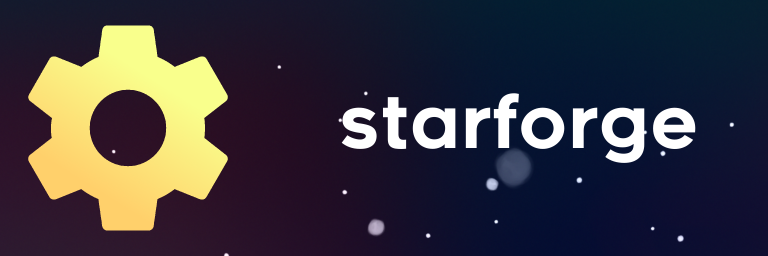

	

---

Starforge is an experimental map editor for Celeste. **It is still in very early development, and may never reach a usable state.** If you are interested in creating maps, you are better off taking a look at [Ahorn](https://github.com/CelestialCartographers/Ahorn) for now.

---
# Compiling from Source
To compile from source, you can clone this repository and then build using Visual Studio or the toolkit of your choice. Make sure to recursively clone submodules and restore NuGet packages if necessary. You will need a build of FNA and its associated libraries to run Starforge. FNA is provided as a submodule which you can build yourself, and the native libraries can be found on [the wiki.](https://fna-xna.github.io/download/) Place the native libraries in the output directory containing `Starforge.exe`.

---
# Contributing
Contributions are currently not accepted. You are, however, welcome to create a fork of your own. While it's preferred that in doing so you change the name and logo of your version of the project, I can't force you to do so.

---
# License
Starforge is licensed under the [MIT License.](https://github.com/WoofWoofDoggo/Starforge/blob/main/LICENSE) It also makes use of various open source projects, whose licenses can be found below.

- [FNA](https://github.com/FNA-XNA/FNA), which is under the [Microsoft Public License.](https://github.com/FNA-XNA/FNA/blob/master/licenses/LICENSE)
- [ImGUI.NET](https://github.com/mellinoe/ImGui.NET), which is under the [MIT License.](https://github.com/mellinoe/ImGui.NET/blob/master/LICENSE)

---
